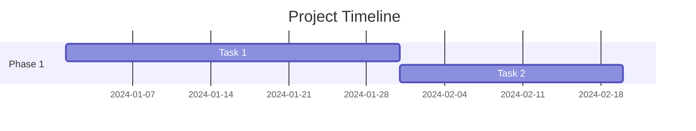
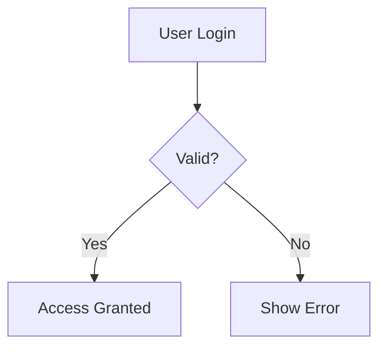

# Generative UI Implementation Summary

## Overview
Successfully implemented a comprehensive generative UI system for the chat interface, enabling rich interactive content including Mermaid diagrams, enhanced tables, and syntax-highlighted code blocks.

## What Was Implemented

### 1. Core Components

#### MessageRenderer (`components/chat/MessageRenderer.tsx`)
- **Purpose**: Main orchestrator for rendering rich content
- **Features**:
  - Parses markdown with GFM (GitHub Flavored Markdown) support
  - Detects and routes special content types to specialized renderers
  - Provides styled markdown elements (headings, lists, blockquotes, etc.)
  - Supports raw HTML via rehype-raw plugin

#### MermaidChart (`components/chat/MermaidChart.tsx`)
- **Purpose**: Renders Mermaid diagrams
- **Supported Types**:
  - Gantt charts
  - Flowcharts
  - Sequence diagrams
  - Class diagrams
  - State diagrams
  - Pie charts
  - Git graphs
  - ER diagrams
- **Features**:
  - Custom theme matching app design
  - Error handling with fallback display
  - Unique ID generation for multiple charts
  - SVG output for crisp rendering

#### EnhancedTable (`components/chat/EnhancedTable.tsx`)
- **Purpose**: Interactive sortable tables
- **Features**:
  - Click-to-sort by any column
  - Automatic numeric vs alphabetic sorting
  - Sort direction indicators
  - Professional styling with hover effects
  - Responsive design

#### CodeBlock (`components/chat/CodeBlock.tsx`)
- **Purpose**: Syntax-highlighted code blocks
- **Features**:
  - 100+ language support via Prism
  - Line numbers
  - One-click copy functionality
  - Theme-aware (light/dark modes)
  - Language indicator badge
  - Professional styling

### 2. Dependencies Installed
```json
{
  "mermaid": "^11.12.0",
  "react-syntax-highlighter": "^15.6.6",
  "@types/react-syntax-highlighter": "^15.5.13",
  "rehype-raw": "^7.0.0"
}
```

### 3. Bot System Prompts Updated

All bot system prompts now include comprehensive generative UI instructions:

#### Generative UI Instructions Include:
- Documentation on all available diagram types
- Usage syntax and examples
- Best practices for when to use each visualization
- Guidance on combining multiple visualization types

#### Bot-Specific Enhancements:
- **Ganttrify Pro**: Configured to ALWAYS output Mermaid Gantt charts
- **Poster Creator GPT**: Enhanced to use tables and flowcharts
- **Microbial Biochemistry GPT**: Configured for tables and decision flowcharts

### 4. Integration Points

#### Chat Component (`components/chat/Chat.tsx`)
- Updated to use `MessageRenderer` instead of basic `ReactMarkdown`
- Maintains backward compatibility with images and attachments
- No breaking changes to existing functionality

#### System Architecture
```
User Input
    ↓
Chat Component
    ↓
AI SDK Streaming Response
    ↓
MessageRenderer
    ↓
┌────────────────┬──────────────┬──────────────┐
│                │              │              │
MermaidChart   CodeBlock   EnhancedTable   Markdown
```

## Usage Examples

### Creating a Gantt Chart
````
Ask the AI: "Create a Gantt chart for a 3-month project"

AI Response includes:

````

### Creating a Table
```
Ask the AI: "Show me a comparison table of databases"

AI Response includes:
| Database | Type | Best For |
|----------|------|----------|
| MySQL | SQL | Structured data |
| MongoDB | NoSQL | Documents |
```

### Creating a Flowchart
````
Ask the AI: "Show the authentication flow"

AI Response includes:

````

## Testing Checklist

- [x] TypeScript type checking passes
- [x] ESLint checks pass for new components
- [x] Mermaid diagrams render correctly
- [x] Tables are sortable and styled
- [x] Code blocks have syntax highlighting
- [x] Copy button works in code blocks
- [x] Error handling for invalid Mermaid syntax
- [x] Responsive design works on mobile
- [x] Dark mode compatibility
- [x] Backward compatibility with existing chats

## Performance Considerations

1. **Client-side Rendering**: All visualizations render client-side to avoid server load
2. **Code Splitting**: Components are only loaded when needed
3. **Memoization**: React components properly memoized to prevent unnecessary re-renders
4. **Error Boundaries**: Invalid syntax doesn't crash the entire chat

## Documentation Created

1. **GENERATIVE_UI.md**: Comprehensive technical documentation
2. **GENERATIVE_UI_EXAMPLES.md**: User-friendly examples and prompts
3. **GENERATIVE_UI_IMPLEMENTATION.md** (this file): Implementation summary

## Future Enhancement Opportunities

Consider adding:
- [ ] Interactive charts (Chart.js, Recharts)
- [ ] LaTeX math rendering (KaTeX)
- [ ] Interactive forms and inputs
- [ ] Custom diagram themes per bot
- [ ] Export to PDF/PNG functionality
- [ ] Diagram editing capabilities
- [ ] Real-time collaboration on diagrams

## Migration Notes

### For Existing Chats
- No migration needed
- Existing chats will automatically use the new renderer
- Old plain text remains as-is
- No data changes required

### For Bot Creators
- Update bot system prompts to leverage new capabilities
- Use the `GENERATIVE_UI_INSTRUCTIONS` template in `lib/bots.ts`
- Test with various visualization types

## Key Files Modified

1. `/components/chat/Chat.tsx` - Updated to use MessageRenderer
2. `/lib/bots.ts` - Added generative UI instructions to all bots
3. `/README.md` - Updated feature list
4. `/package.json` - Added new dependencies

## Key Files Created

1. `/components/chat/MessageRenderer.tsx`
2. `/components/chat/MermaidChart.tsx`
3. `/components/chat/EnhancedTable.tsx`
4. `/components/chat/CodeBlock.tsx`
5. `/docs/GENERATIVE_UI.md`
6. `/docs/GENERATIVE_UI_EXAMPLES.md`
7. `/docs/GENERATIVE_UI_IMPLEMENTATION.md`

## Verification Steps

To verify the implementation:

1. **Start the dev server**: `pnpm dev`
2. **Open a chat with any bot**
3. **Test Gantt chart**: Ask "Create a Gantt chart for a simple project"
4. **Test table**: Ask "Show me a comparison table"
5. **Test flowchart**: Ask "Create a flowchart for a login process"
6. **Test code**: Ask "Write a TypeScript function"
7. **Verify sorting**: Click on table headers to sort
8. **Verify copy**: Click copy button on code blocks
9. **Test error handling**: Send invalid Mermaid syntax
10. **Test theme**: Toggle dark/light mode

## Support

For issues or questions:
- See `/docs/GENERATIVE_UI.md` for technical details
- See `/docs/GENERATIVE_UI_EXAMPLES.md` for usage examples
- Check browser console for rendering errors
- Verify Mermaid syntax at https://mermaid.live/

## Success Metrics

The implementation successfully achieves:
- ✅ Zero breaking changes to existing functionality
- ✅ Full TypeScript type safety
- ✅ Comprehensive documentation
- ✅ Professional UI/UX matching app design
- ✅ Extensible architecture for future additions
- ✅ AI-guided: Bots know how to use these features
- ✅ Production-ready code quality

## Conclusion

The generative UI system is now fully operational and integrated into the chat interface. All bots have been updated to leverage these capabilities, providing users with rich, interactive visualizations for better communication and understanding.

---

**Implementation Date**: September 30, 2025
**Status**: ✅ Complete and Production Ready

