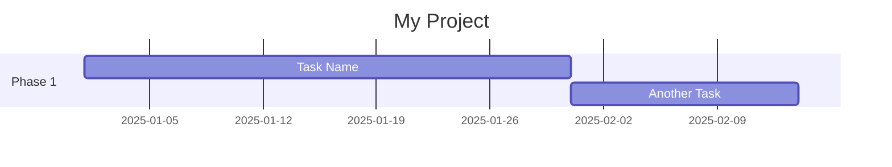
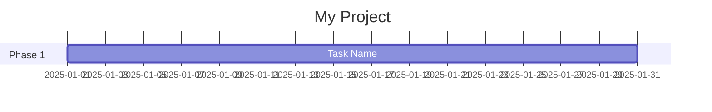
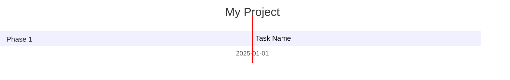
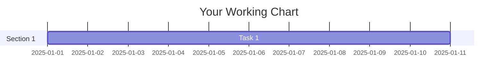
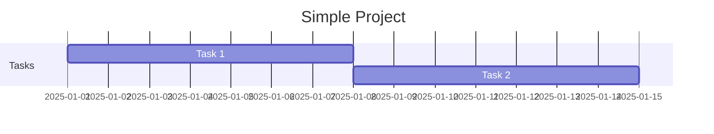

# Mermaid Chart Troubleshooting Guide

## 🚨 Getting "Error parsing" errors?

### Step 1: **SYNC YOUR BOTS** (Most Common Issue!)

The bot instructions in your database are likely outdated. You MUST sync:

1. Navigate to: `http://localhost:3000/app/admin`
2. Click the **"Run sync"** button
3. Wait for success message
4. **Start a COMPLETELY NEW chat** (old chats use old instructions)

### Step 2: Check the Error Details

When a chart fails to render, the error message now shows:
1. **The actual error** from Mermaid
2. **The chart code** that failed (click to expand)
3. **Common fixes** specific to that error type

### Step 3: Common Mermaid Gantt Syntax Errors

#### ✅ CORRECT Syntax:


#### ❌ WRONG Syntax Examples:

**Missing dateFormat:**

Error: "Parse error" or "Invalid date"

**Wrong date format:**

Must use: `2025-01-01`

**Invalid task ID:**

Task IDs must be lowercase letters only: `task1`, `lit`, `exp`, etc.

**Wrong indentation:**

Each line after `gantt` needs 4 spaces before it.

**Extra characters:**


### Step 4: Manual Chart Creation

If the AI keeps generating bad syntax, you can create it manually:

1. Use the [Mermaid Live Editor](https://mermaid.live/) to test your chart
2. Once it works there, paste it into a message
3. Wrap it in triple backticks with `mermaid`:

````

````

### Step 5: Check the Browser Console

1. Open DevTools (F12)
2. Look for red errors
3. Look for the actual Mermaid error message
4. It will tell you exactly what line has the problem

### Common Error Messages Decoded:

| Error Message | Likely Cause | Fix |
|--------------|--------------|-----|
| "Parse error on line X" | Syntax error at that line | Check spacing, colons, commas |
| "Invalid date" | Date not in YYYY-MM-DD format | Use 2025-01-01 format |
| "No diagram type detected" | Missing or misspelled diagram type | Start with `gantt` or `flowchart TD` |
| "Error executing queue" | Multiple syntax errors | Check all of the above |

### Step 6: Still Not Working?

1. **Verify bot sync**: Check `app/admin` - does it show your bots?
2. **Check database**: Your bots table should have the updated system prompts
3. **New chat required**: Old chats cached the old bot instructions
4. **Clear browser cache**: Sometimes helps with component issues

### Testing with a Known-Good Chart

Try this simple chart to verify the system works:

````
Ask the bot: "Create a simple Gantt chart with 2 tasks"

Expected output:

````

If this works, the system is functioning correctly.

### Debug Mode

To see exactly what the AI is generating:

1. Open your browser's DevTools (F12)
2. Go to Console tab
3. Look for "Mermaid rendering error:" messages
4. The chart code will be logged there
5. Copy it and test at https://mermaid.live/

---

## Quick Reference: Valid Gantt Syntax

```mermaid
gantt
    title [Your Title]
    dateFormat YYYY-MM-DD
    section [Section Name]
    [Task Name]    :[id], [YYYY-MM-DD], [Xd]
    [Task Name]    :[id], after [previous_id], [Xd]
```

**Rules:**
- 4 spaces before title, dateFormat, section, and tasks
- Task IDs: lowercase letters only (task1, lit, exp)
- Dates: YYYY-MM-DD format (2025-01-01)
- Duration: number + 'd' (30d, 14d, 7d)
- Or: `after [task_id]` for sequential tasks

---

**Last Updated:** 2025-09-30

